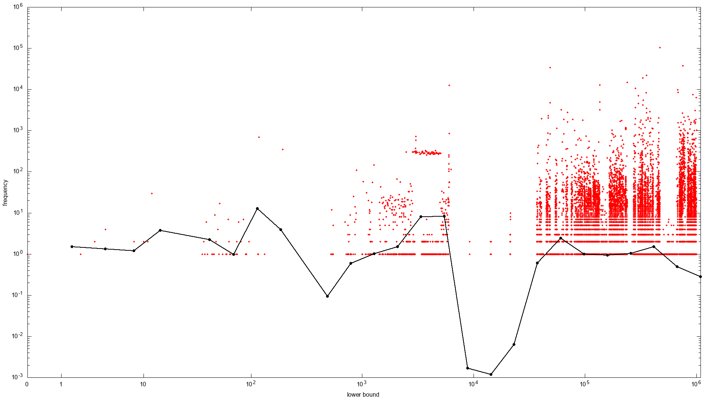

This is the work for my CS master's degree thesis, under the supervision of professors [Paolo Boldi](http://boldi.di.unimi.it/) and [Sebatiano Vigna](http://vigna.di.unimi.it/).

This repository contains an extension to [WebGraph](http://webgraph.di.unimi.it/), adding an implementation of the Partitioned Elias-Fano algorithm as presented by Ottaviano and Venturini in [their paper](https://rossanoventurini.github.io/papers/SIGIR14.pdf).
It uses classes and interfaces and structures from WebGraph, adding the Partitioned Elias-Fano (PEF) algorithm to the ones already available on the library. The implementation of PEFGraph is [here](src/it/unimi/dsi/webgraph/PEFGraph.java).

Some performance tests have been run to compare Partitioned Elias-Fano to Elias-Fano and BVGraph from WebGraph and to the k2 tree algorithm as presented [here](https://arxiv.org/abs/1812.10977) and implemented [here](https://github.com/simongog/sdsl-lite). The code run for the tests is [WebGraphTester](https://github.com/gioaudino/WebGraphTester). Some other utilities can be found [here](https://github.com/gioaudino/BVGraph-converters).

Note that much of the code contained in PEFGraph is boilerplate copied over from the BVGraph class to add the implementation of some helper methods.

# Partitioned Elias-Fano

The idea behind Partitioned Elias-Fano as highlighted by Ottaviano and Venturini is that the Elias-Fano representation for monotonic sequences has been successfully used to compress inverted indexes with excellent performances but, even if the space used is comparable to other methods (such as &gamma;-&delta;-Golomb or PForDelta), compressing a monotonic sequence using Elias-Fano doesn't exploit the fact that the adjacency list of a web graph is heavily clusterised, i.e. it's very common in a web graph to have consecutive successors. The Partitioned Elias-Fano algorithm splits the successor list into sublists to get a better compression.

Consider the Elias-Fano approach, where the space needed is `2 + log (u/m)` bit per element, with u being the upper bound of the sequence and m the number of elements to compress in the sequence. If you imagine having to compress a monotonic sequence of m consecutive numbers, all you'd need to compress it is the leftmost (or rightmost) element and the length of the sequence. Elias-Fano, on the other hand, requires the exact same space needed for a list of random values, ignoring the fact that they're all consecutive. The idea of PEF is then to divide each sequence in chunks and compress each subsequence using the most efficient algorithm.

## The optimal partition

A key point in the algorithm is that it will use a two-layer approach to compress the graph. The 'first level' contains some metadata needed to understand how the division into chunks is done and how to decompress each chunk. A 'second level' contains some finer data about the specific chunk. Finding the optimal partition isn't trivial since one one hand one would want to make the chunks as large as possible to minimise the overhead that comes with having to write extra elements on the first level, but on the other hand one would want to minimise the size of a chunk because this creates smaller universes, hence a better Elias-Fano compression for the second level.

In their paper, the authors suggest an exhaustive dynamic programming algorithm to find the optimal partition, but this would take &theta;(n2) time and it's not feasible for graphs as large as web graphs. The authors also proposed an approximation algorithm, that is the one used in this implementation.  
The cost of each subsequence is the sum of two values: the cost for an element on the first level, that is fixed and doesn't change depending on the compression algorithm used for the second level, and the cost for the second level, that does depend on the algorithm. The first level contains three integers per chunk and one to index the bit vector of the second level, to know where the second level representation of the items of that specific chunk begins. The cost of the second level for the partition `S[i,j]`, where `i` and `j` represent the index of the beginning and end of the sequence, and being `u'` the size of the universe of the chunk and `m'` the number of elements of the chunk, the cost for the second level is:

* 0 bits if `m' = u'`,
* `m' = j − i + 1` if using Elias-Fano for `S[i,j]` would use more than `u'` bits, in which case a bitmap is cheaper, or
* `m'(⌊log u'⌋ + 2)` if compressed with Elias-Fano.

An important property to have the approximation algorithm work is that the cost function *C* is monotonic: for each `i`, `j`, `k` so that `0 ≤ i < j < k ≤ m` then `C(S[i,j]) ≤ C[i.k]`. In other words, adding elements to the end of a chunk can't make the cost lower but can, at most, not increase it.

### Finding the optimal partition

The algorithm to find the optimal partition is reduced to finding the minimum path on a specific acyclic directed graph *G*. Given the sequence *S* of `m` integers, *G* is the graph having a vertex v0, v1, ..., vm-1 for each of the positions of *S* and a final fake vertex vm that represents the end of the sequence. The interval will always be expressed including the first value and excluding the last one, and the size of the interval is therefore the difference between the two indexes. *G* is a complete graph in the sense that for each `i`, `j` where `i < j ≤ m` there's an edge from `i` to `j`. In other words, each vertex has an edge to each of the following nodes and has an incoming edge from each preceding node.

Note that there's a one-to-one matching between the paths from v0 to vm and the partitions of *S*. A path &pi; = (v0, vi1)(vi1, vi2) ... (vik-1, vim) through *k* edges corresponds to the partition *S[0, i1 - 1][i1, i1 - 1]...[ik-1, m - 1]* made of *k* blocks. If each edge is assigned the weight *w(vi, vj) = C(S[i, j-1])* with *C()* being the cost function, the weight of the path is the cost to compress the corresponding partition, in bits. The problem of finding the best partition is now the problem of finding the cheapest path in *G*. However, this algorithm's time complexity is linear in the number of edges that, in a complete graph, is not a good solution. The authors of the paper suggest the following approximation algorithm.
The authors suggest an approximation algorithm to find the partition, and it's the [one implemented and used in this project](src/com/gioaudino/thesis/ApproximatedPartition.java).

## Data structures

The implementation in this repository writes and reads three vectors:

* **Offset**: the offset vector contains exactly `n` values, `n` being the number of nodes in the graph. The element in position `i` contains the position of the firstLevel vector from which the data for the node `i` begins.
* **FirstLevel**: vector containing metadata about the graph (see below). One of the value it contains is the index from which to read the bitstream.
* **Bitstream**: a proper bit stream which, depending on the case, can be a bitvector of a subsequence or an Elias-Fano encoding.

### Analysing the first level
The only element consistently containing the same thing is the one pointed by the offset array. If you read the position `x` of the offset (*O[x])*), the value in the corresponding position in firstLevel (*F[O[x]]*) is the out-degree of the node `x`. The number of elements about `x` in firstLevel depends on the length of its posting list and on the distribution of the values in such list, since that impacts its partition. If the out-degree is 0, no other values are written for that node since this is all is needed to answer any query. The following value will be the out-degree of the next node.  

If the posting list has at least one element, the next value is the lowerbound of the posting list of x, i.e. the first successor. Storing this value means saving the space of a whole first level block in some edge cases (e.g. a list of `n` consecutive values where the first is much bigger than 0. The algorithm would probably suggest to have a first block of only the first element, to reduce the size of the universe, then the rest of the list as a second, cheap, block). Obviously this makes sense because we don't expect to see multigraphs (i.e. the successors list contains distinct elements) and because we know that in the web subsequences of consecutive successors are frequent.

Each subsequence identified by the approximation algorithm contains 2 or 3 elements in the firstLevel vector:

* **max**: the first value of the subsequence is the maximum (i.e. last) element contained in the subsequence. This makes it possible to evaluate the size of the universe (`max - lowerbound`).
* **size**: this is also in all subsequences, and represents the number of elements in it. With this and the previous value, one can re-evaluate the cost function used during compression to find out which compression strategy was used for this specific block.
* **index**: this value is only present if the number of elements to compress is less than the number of elements in the universe. It's the value used to index the bitstream to find the values for this subsequence.

### [Compressing the graph](src/it/unimi/dsi/webgraph/PEFGraph.java#L924)

The algorithms navigates the graph from the 0-indexed node and, for each, compresses the posting list. It starts writing the out-degree in firstLevel and its index in the offset. If the out-degree isn't 0, it then writes the first element and moves to analyse the successors list. The lowerbound of the subsequence will be the first element, in the case of the first block, and will be the maximum of the previous subsequence + 1 for each other subsequence. The [method](src/com/gioaudino/thesis/ApproximatedPartition.java#L12) that analyses the list to find the partition returns a list of [Partition](src/com/gioaudino/thesis/Partition.java) instances, each including three values: the leftmost item (included in the sequence), the rightmost item (excluded) and the algorithm to use to compress this specific subsequence.

### Further compression

The bitstream contains the best compression we can achieve for the element of the sequence and the offset vector is a cost we can't do without. It's also already compressed, since each element is stored as the difference from the previous element, and saved as its Elias-&gamma; compressed value.

The firstLevel is the vector that can be compressed further. The algorithm chosen to compress the values is &gamma; encoding for each value, trying to minimise the values to save hence the number of bits needed for each element. As previously analysed, there are five values stored for each posting list: the node's out-degree, the list's lowerbound (i.e. the first element) and, for each chunk, the biggest element, the length of the subsequence and the index from which to read in the bistream. The following is how those could and have been better compressed:

* Out-degree: this is just written in &gamma;. There isn't a correlation between a node's out-degree and any other value.
* Lowerbound: given the locality principle, the node `i` often has neighbours close to `i`. Hence, we can store `i`'s lowerbound as the gap from `i`. Since this could also be negative, the method `int2nat` is used, so that negative numbers can be mapped to positive values. This changed the distribution of lowerbound values, as the following pictures show.

<!--
-->

* Max: given that each posting list is a strictly increasing monotonic sequence, the maximum values of each subsequence will also be strictly increasing. Furthermore, the difference between two consecutive max values is at least the size of the second chunk: if chucnk *i* has max *a* and chunk *i+1*, long *n*, has *b* as its max, then *b - a ≥ n*. Exploiting this, each max is saved as the difference with the previous chunk's max minus the size of the chunk: in this example, the value for the max of the chunk *i+1* would be *b-a-n*. For the first chunk, the lowerbound acts as the max of the previous sequence. The change was impactful, as these picture show.

<!--
-->

* Size: since no chunk can have 0 values, the code used to write these values is &gamma; non-zero (each element is decreased by one unit during compression and corrected during decompression). Furthermore, since the sum of the sizes of all chunks is the out-degree of the node, the value is saved for all chunks except the last one, as it can be derived by the out-degree and the sum of the sizes of the other chunks.
* Bitstream index: this is possibly the most expensive of these values given that a bigger graph would have many nodes and the index to access the lower level bitstream would also increase quickly. We could always store the difference with the previous index but the graph should have fast random access and this would make it impossible. We can, however, save the difference within a single posting list. The first index would be written explicitly and the following ones are stored as the difference with the previous one. Furthermore, if a chunk shuold save *n* elements in a universe of size *n* there's no need to store any value and the index is omitted. In the same way, if a chunk is compressed using a bitvector, the difference between the indexes is known: it's the size of the bitvector. Given this reasoning, the index is always stored for the first chunk, and then for only the chunks compressed with Elias-Fano. Before the compression, the distribution of these values had unique elements, while the following is the distribution of values after this strategy was set in place.

<!---->

### [Accessing the compressed graph](src/it/unimi/dsi/webgraph/PEFGraph.java#L1514)

The graph is usually accessed in one of three ways:

* Selection: given a node *x* and an integer *i*, find the *i th* successor of *x*.
* Ranking: given a node *x* and an integer *i*, find the first successor of *x* greater or equal to *i*
* [Adjacency](src/it/unimi/dsi/webgraph/PEFGraph.java#L1670): given two nodes *x* and *y* find whether there is an edge from *x* to *y*.

The interface of [ImmutableGraph](http://webgraph.di.unimi.it/docs/it/unimi/dsi/webgraph/ImmutableGraph.html) wants a lazy interator for the successors of *x* but in this work the posting list was decompressed completely and a non-lazy iterator was returned instead. Selection and ranking are therefore run on the decompressed sequence.

## Results

